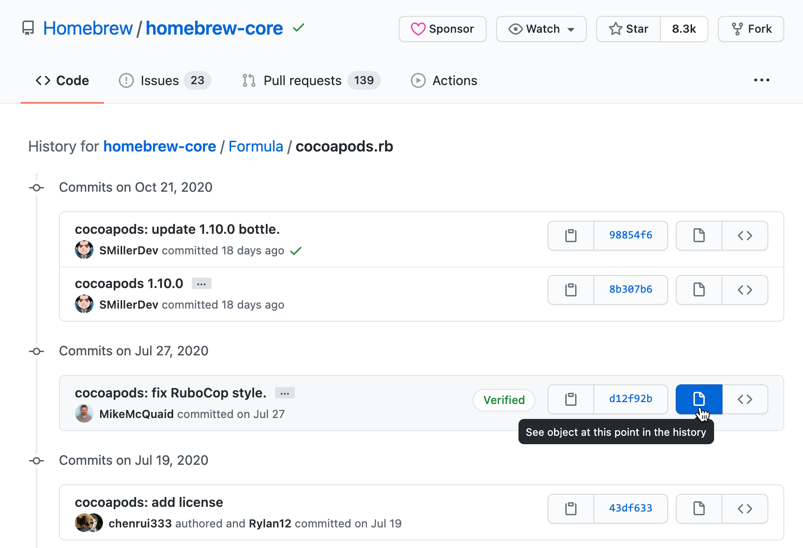
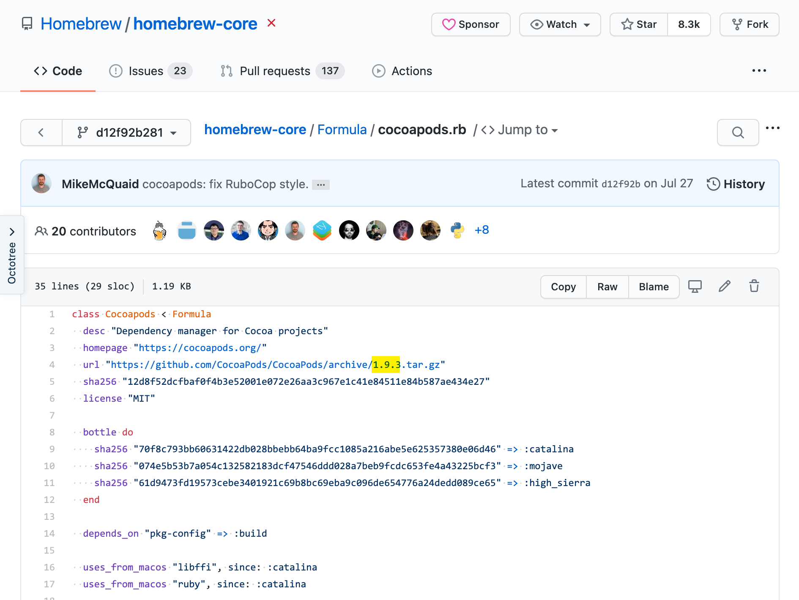

最近Xcode编译项目突然报错 [Multiple commands produce error with XCFramework](https://github.com/CocoaPods/CocoaPods/issues/10106)，经查应该是最近某次brew升级，将 cocoapods 自动升级到了最新的 1.10 导致的配置兼容问题。

```
From the CocoaPods perspective you have 2 different pods that produce the same xcframework. Xcode New Build System is much stricter and does not allow that.
```

据相关了解，cocoapods 1.10 开始对 [xcframework](https://blog.csdn.net/olsQ93038o99S/article/details/107804423) 的处理有点不一样，项目组建议暂时还是用回 1.9。

## brew

执行 `pod --version` 查看当前 pod 版本：

```
$ pod --version
1.10.0
```

执行 `which pod` 命令查看 `pod` 命令所在位置：

```
$ which pod
/usr/local/bin/pod
```

### unlink latest

执行 `readlink` 命令读取 pod 软链在 `brew --cellar` 中的真实安装位置：

```
$ readlink `which pod`
../Cellar/cocoapods/1.10.0/bin/pod
```

执行 `brew unlink cocoapods` 解除 cocoapods 1.10.0 到 `/usr/local/bin/pod` 的软链。

> 执行 unlink 不会删除 `/usr/local/Cellar/cocoapods` 下已安装的 1.10.1。

### find old formula

[用Homebrew安装指定版本软件](https://www.jianshu.com/p/84d79beb469c)

从 https://github.com/Homebrew/homebrew-core/tree/master/Formula 中查找 cocoapods：

```
https://github.com/Homebrew/homebrew-core/blob/master/Formula/cocoapods.rb
```

在 History 中查找 1.10.0 升级之前的 `d12f92b2` 版本：



点击打开 [d12f92b2](https://github.com/Homebrew/homebrew-core/blob/d12f92b2810958515b7cc975857f22efa2588cdb/Formula/cocoapods.rb) 版本：



点击 `Raw` 查看其原始链接，尝试执行 `brew install` 安装该版本： 

```
brew install https://raw.githubusercontent.com/Homebrew/homebrew-core/d12f92b2810958515b7cc975857f22efa2588cdb/Formula/cocoapods.rb
```

Raw 链接如果无法访问或安装报错，可以将 Raw 文件保存下载到本地，再执行 `brew install` 从本地 rb 安装：

```
brew install cocoapods.rb
```

**注意**：如果上面没有执行 `brew unlink cocoapods` 将报错：

```
Error: cocoapods 1.10.1 is already installed
To install 1.9.3, first run:
  brew unlink cocoapods
```

> 根据提示，需要先执行 unlink 解除现有 cocoapods 1.10.0 的软链。

重新执行 `pod --version` 确认已装回旧版 pod：

```
$ pod --version
1.9.3
```

此时，cocoapods 安装目录下，将同时存在 1.10.1 和 1.9.3：

```
$ tree -L 1 `brew --cellar`/cocoapods
/usr/local/Cellar/cocoapods
├── 1.10.1
└── 1.9.3

2 directories, 0 files
```

此时执行 `brew info cocoapods`，查看已安装的 cocoapods，也会列举新旧两个版本：

```
$ brew info cocoapods
Warning: Treating cocoapods as a formula. For the cask, use homebrew/cask/cocoapods
cocoapods: stable 1.10.1 (bottled)
Dependency manager for Cocoa projects
https://cocoapods.org/
/usr/local/Cellar/cocoapods/1.9.3 (12,523 files, 28.3MB) *
  Poured from bottle on 2021-02-21 at 09:52:38
/usr/local/Cellar/cocoapods/1.10.1 (13,132 files, 30.5MB)
  Poured from bottle on 2021-02-06 at 08:12:51
From: https://mirrors.ustc.edu.cn/homebrew-core.git/Formula/cocoapods.rb
License: MIT
==> Dependencies
Build: pkg-config ✔
==> Analytics
install: 37,421 (30 days), 115,134 (90 days), 347,296 (365 days)
install-on-request: 37,389 (30 days), 114,922 (90 days), 345,867 (365 days)
build-error: 0 (30 days)
```

### pin old formula

执行 `brew pin cocoapods` 固定当前 pod 版本（1.9.3），防止后续执行 `brew upgrade` 时自动升级！！！

### upgrade

后面想升级时，再执行 `brew unpin cocoapods` 解锁，再执行 `brew switch cocoapods 1.10.1` 或 `brew upgrade cocoapods`。

> 最新版 homebrew 已不再支持 brew switch 命令！

## gem

[Ruby Gem 命令详解](https://www.jianshu.com/p/728184da1699)  

[How to Install a Specific Version of a Ruby Gem](https://howchoo.com/ruby/gem-install-specific-version)  
[How to install a specific version of a ruby gem?](https://stackoverflow.com/questions/17026441/how-to-install-a-specific-version-of-a-ruby-gem)  

[How to Install an Older Brew Package](https://itnext.io/how-to-install-an-older-brew-package-add141e58d32)  
[安装指定版本的CocoaPods](https://blog.z6z8.cn/2019/10/31/%E5%AE%89%E8%A3%85%E6%8C%87%E5%AE%9A%E7%89%88%E6%9C%AC%E7%9A%84cocoapods/)  
[CocoaPods安装指定版本](https://www.cnblogs.com/shenhongbang/p/4409360.html)  
[iOS：安装指定版本cocoapods](https://www.jianshu.com/p/3c1f439ba1ca)  

执行 `gem search cocoapods` 查看 gem 版本库，其中 cocoapods 版本已是最新：

```
$ gem search cocoapods

*** REMOTE GEMS ***

cocoapods (1.10.0)
```

执行 `gem install -v` 命令安装指定版本：

```
$ sudo gem install -n /usr/local/bin cocoapods -v 1.9.3
```

没有实测。
